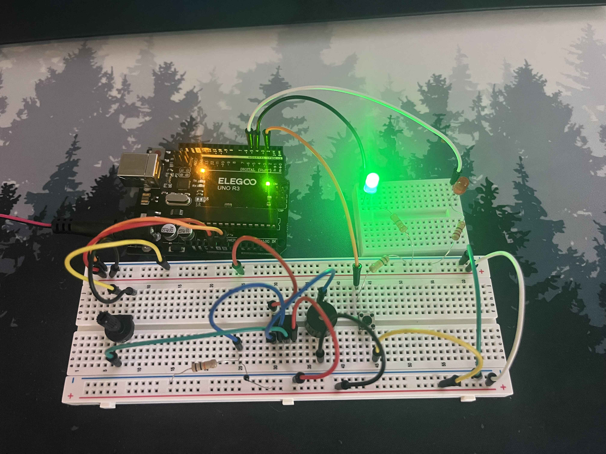
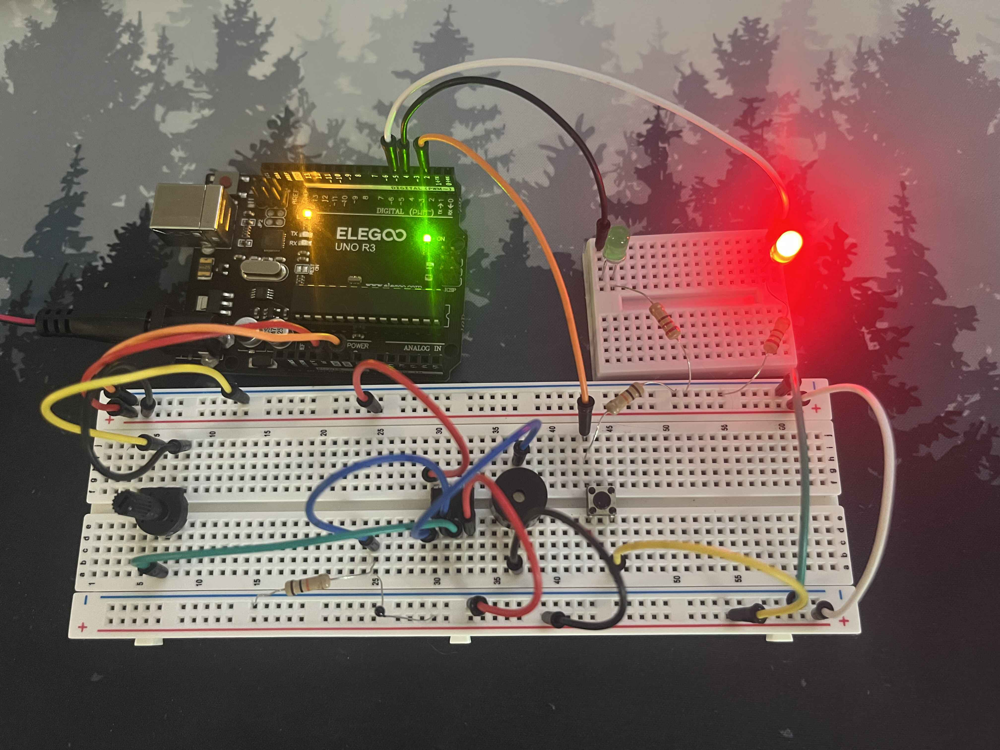
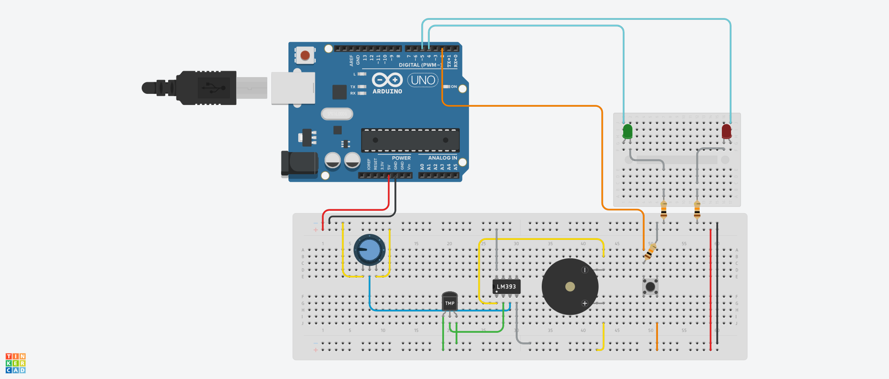

# Danger Detection Device: Hybrid Mixed-Signal Watchdog Architecture

An embedded systems proof-of-concept demonstrating a dual-layer industrial fail-safe. The system features a **Digital Monitoring State** running on a microcontroller alongside an **Independent Analog Hardware Safety Loop**. If the software environment completely crashes or undergoes an intentional execution freeze, the autonomous analog loop remains fully operational to detect thermal hazards and trigger immediate hardware alarms.

---

## Project Demonstrations

### System Video Walkthrough
[](https://www.youtube.com/watch?v=Goc9dhGlelw)

### Circuit States
| Normal Operation (Software Running) | Software Freeze State (System Locked) |
|---|---|
|  |  |
| *Green LED cycles actively, tracking software execution loops.* | *Software execution is fully locked up; Red LED latches high.* |

---

## System Architecture & How It Works

This project implements a hardware architecture modeled after critical safety systems found in industrial automation, medical equipment, and aerospace systems where a software failure cannot be allowed to disable emergency cut-offs.

                +---------------------------------------+
                |             5V Power Rail             |
                +-------------------+-------------------+
                                    |
           +------------------------+------------------------+
           |                                                 |
           v                                                 v
      [ Digital Layer: Arduino ]                       [ Analog Layer: LM393 ]
      +--------------------------+                     +-------------------------+
      |  - Tracks Run-Time Clock |                     | - Reads Thermistor      |
      |  - Alternates Green LED  |                     | - Compares to Pot. Vref |
      |  - Checks For Sabotage   |                     | - Directly Drives Alarm |
      +--------------+-----------+                     +------------+------------+
                     |                                              |
                     v (Button Press)                               v (Thermal Spike)
             [ SOFTWARE FREEZE ]                          [ AUTONOMOUS BUZZER ]
          (Infinite while(1) loop)                      (Bypasses Dead Processor)
  


1. **The Digital Layer (Software Supervision):** The Arduino Uno actively displays condition, represented by a green status LED. If a fatal error occurs or if the physical "Danger" button is triggered, the microcontroller drops into an isolated infinite loop (`while(true)`), simulating a hard code crash. A red LED illuminates to visually flag the frozen digital environment.
2. **The Analog Layer (Independent Fail-Safe):** An LM393 voltage comparator continuously scales and judges voltage swings coming from a thermal sensor network against a manual reference voltage ($V_{ref}$) tuned via a potentiometer. Because this layer relies entirely on discrete integrated circuitry, it retains structural integrity regardless of the microcontroller's processing state. If a thermal threat arises while the software layer is entirely non-responsive, the analog loop triggers the alarm instantly.

---

## Interactive Schematic & Wiring

The system schematic was modeled and simulated using Tinkercad Circuits to validate the logic voltage levels across the differential comparator inputs.



> **Note on Simulation Environment:** Due to standard library component mappings within Tinkercad Circuits, a three-pin active silicon TMP36 sensor was utilized to establish linear analog voltage outputs for the repository's online schematic documentation. The physical hardware assembly employs a high-sensitivity discrete negative temperature coefficient (NTC) thermistor within a $10\text{ k}\Omega$ voltage divider bridge configuration.

### Component Bill of Materials (BOM)

| Qty | Component Description | Primary Function |
| :---: | :--- | :--- |
| **1** | Arduino Uno R3 Microcontroller | Digital runtime & process simulation |
| **1** | LM393 Dual Voltage Comparator | Independent analog hardware decision processor |
| **1** | NTC Thermistor / TMP36 Sensor | Environmental heat transducer |
| **1** | $10\text{ k}\Omega$ Linear Potentiometer | Manual analog alarm trip threshold adjustment |
| **1** | 5V Active Buzzer | Direct hardware emergency auditory alarm |
| **1** | Push-button Switch | System intentional crash injection trigger |
| **2** | $10\text{ k}\Omega$ Resistors | Pull-down network (Button) & Voltage Divider leg |
| **2** | $220\text{ }\Omega$ Resistors | Current-limiting protection for indicator LEDs |
| **1** | High-Brightness Green LED | Visual execution pulse indicator |
| **1** | High-Brightness Red LED | Visual system hardware freeze fault indicator |

---

## Source Code

The firmware loaded onto the digital layer utilizes a trapping loop mechanism to mimic an embedded processor lockup upon detecting an interrupt stimulus from physical IO.

```cpp
// Hardware IO Mapping
const int SWITCH_INPUT_PIN = 2; // Interrupt injection switch
const int PROCESS_LED_GREEN  = 4; // Cyclic software health heartbeat
const int SYSTEM_FAULT_RED   = 5; // Hard fault lockup notification

void setup() {
  pinMode(SWITCH_INPUT_PIN, INPUT);
  pinMode(PROCESS_LED_GREEN, OUTPUT);
  pinMode(SYSTEM_FAULT_RED, OUTPUT);
  
  // Establish baseline state defaults
  digitalWrite(PROCESS_LED_GREEN, HIGH);
  digitalWrite(SYSTEM_FAULT_RED, LOW);
}

void loop() {
  // 1. Emulate baseline system clock ticking 
  digitalWrite(PROCESS_LED_GREEN, HIGH);
  delay(250);
  digitalWrite(PROCESS_LED_GREEN, LOW);
  delay(250);

  // 2. Poll for System Interruption/Crash Simulation
  if (digitalRead(SWITCH_INPUT_PIN) == HIGH) {
    // Drop the active execution layer flag
    digitalWrite(PROCESS_LED_GREEN, LOW); 
    
    // Latch the structural system error line
    digitalWrite(SYSTEM_FAULT_RED, HIGH);  
    
    // INTERRUPT TRAP: Force absolute microcontroller freeze
    while(true) {
      // The MCU is locked in this infinite branch block.
      // Software is now blind to IO polling, registers, and timing vectors.
    }
  }
}
